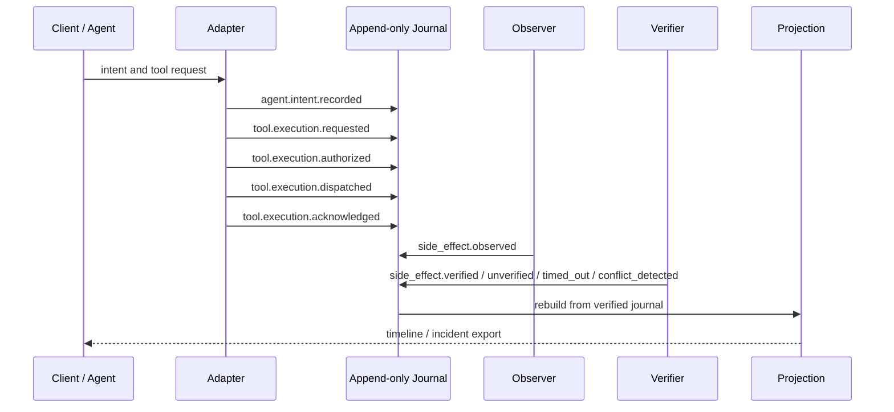

# Architecture

## Architectural approach

Use a modular monorepo with explicit package boundaries. Start as one Python distribution while keeping core interfaces separate enough to publish packages later.

The pivot makes the append-only journal and neutral evidence model the center of the system. Protocol gateways, policy evaluators, and telemetry exporters are adapters.

## Runtime data flow



An adapter may enforce policy before dispatch, but policy enforcement is optional. Acknowledgement from a tool or adapter is not proof that the side effect occurred.

## Components

### 1. Domain core

Responsibilities:

- IDs and correlation.
- Event envelope and typed payload helpers.
- Principal, credential, resource, action, evidence-link, and verification-state models.
- Canonical serialization contract.
- Redaction interfaces.

The domain core must not depend on FastAPI, MCP, OpenTelemetry, a database, a policy engine, network clients, or a model provider.

### 2. Journal

Use two layers:

- **Source-of-truth journal**: append-only newline-delimited canonical events with a hash chain.
- **Query projection**: a rebuildable SQLite index for timelines and filters.

This keeps the demo local and makes integrity verification independent of the query database. The projection must be disposable and rebuildable from the journal.
ADR-0011 applies the same boundary to future append indexes: they may be
rebuildable caches for idempotency or replay speed. Append indexes are not
canonical evidence or trusted evidence, and must be bound back to verified
journal state before trusted use.

### 3. Observer and verifier adapters

Observers record independently observed resource or environment evidence. Verifiers link subject events to corroborating evidence and record verified, unverified, timed-out, or conflicting outcomes.

Initial demo observers may be local fixture oracles, mock receiver logs, and filesystem readbacks. Their limitations must be explicit in evidence links.

### 4. MCP adapter

Future MCP support belongs under an adapter package boundary.

Responsibilities:

- Upstream/downstream MCP behavior.
- Tool descriptor mirroring.
- Descriptor canonicalization and hashing.
- Mapping MCP messages to neutral evidence events.
- Optional compatibility emission of `agent.tool.*` events.

MCP code must not be imported by domain, journal, projection, or core CLI modules.

### 5. Policy adapter

Expose a narrow optional interface:

```python
class PolicyEvaluator(Protocol):
    async def evaluate(self, request: PolicyRequest) -> PolicyDecision: ...
```

Policy decisions are evidence. Enforcement adapters may deny dispatch, but core evidence recording does not require policy enforcement.

### 6. Telemetry adapter

Emit spans and attributes without making OpenTelemetry the canonical evidence store. Trace export failure must not silently erase the local journal record.

### 7. Detection engine

Consume normalized events and evaluate declarative sequence rules. Keep detection asynchronous with respect to journal persistence. Detection rules should distinguish acknowledged, observed, and verified outcomes.

### 8. Lineage Contracts

Validate fixtures and recorded outputs against requirements. Contracts are CI artifacts, not runtime policy.

### 9. Lineage Lab

Owns scenarios, mutation strategies, replay, scoring, and counterexample minimization. It depends on public interfaces from core, contracts, and detection, never on private implementation details.

## Proposed repository layout

```text
src/actionlineage/
  domain/
  journal/
  projection/
  adapters/
    mcp/
    opentelemetry/
    policy/
  detection/
  contracts/
  lab/
  api/
  cli.py

tests/
  domain/
  journal/
  projection/
  adapters/
  integration/
  security/
  fixtures/
```

## Key invariants

1. Persisted events never contain configured secret material.
2. Each event has exactly one stable event ID and one schema version.
3. Each security-relevant event has a run/trace association and an explicit causal parent unless it is a documented root event.
4. A successful tool response is not proof that a side effect occurred.
5. Requested, authorized, dispatched, acknowledged, observed, and verified are separate states.
6. Verification requires independent or explicitly identified corroborating evidence.
7. Unknown, unverified, timed-out, and conflicting outcomes are representable.
8. The query projection can be deleted and rebuilt without loss of canonical evidence.
9. Hash verification is deterministic across runs and machines.
10. The default demo performs no external network call.

## Failure semantics

- **Journal unavailable**: fail visibly. Adapters that may create side effects must use documented fail behavior and must not execute silently without evidence.
- **Policy evaluator timeout**: apply the adapter's configured fail behavior and emit a local failure event if possible.
- **Tool timeout**: emit acknowledged failure or timeout from the tool boundary, plus unverified/timed-out side-effect status when observation cannot corroborate execution.
- **Observer timeout**: emit `side_effect.timed_out`; do not claim the side effect did not occur.
- **Conflicting evidence**: emit `side_effect.conflict_detected` and preserve both sides of the evidence relationship.
- **Telemetry exporter unavailable**: continue local recording and surface degraded telemetry health.
- **Descriptor change**: emit descriptor-change evidence; protected-tool reapproval belongs to an enforcement adapter.
- **Projection corruption**: rebuild from verified journal.

## Deferred decisions requiring ADRs

- Future `v1alpha2` envelope-level evidence links.
- Local journal anchoring or signatures.
- Exact production corroboration threshold for `verified`.
- OPA versus an alternative external policy engine.
- React/Cytoscape console versus server-rendered UI.
- Postgres support for multi-user deployments.
- eBPF or operating-system sensor integration.
