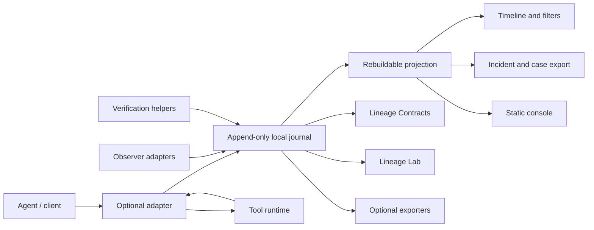

# ActionLineage

**Vendor-neutral evidence and detection for tool-using agents.**

ActionLineage records investigation-ready evidence across agent intent, tool
execution, delegated identity, independently observed side effects, and explicit
verification links. It is built for security teams and agent platform engineers
who need to answer what happened, which identity and tool were involved, which
side effects were corroborated, and which outcomes remain unknown or
unverified.

The core is a local, append-only evidence journal plus a neutral event model.
MCP interception, policy enforcement, OpenTelemetry export, service mode, cloud
observers, and investigation UIs are optional surfaces that translate into the
same evidence model.

## Why ActionLineage

Traditional logs often show isolated API calls. Tool-using agents create a more
complex chain:

- untrusted content can influence a later tool call;
- tool descriptors can drift after approval;
- delegated credentials can change the effective actor;
- a successful tool response can be mistaken for a completed side effect;
- missing telemetry can make a detection look stronger than it is.

ActionLineage keeps those facts separate. Requested, authorized, dispatched,
acknowledged, observed, verified, unverified, timed-out, conflicting, and
not-dispatched outcomes are first-class evidence states. Reports are designed to
say exactly what was observed and which limits apply.

## What You Get

- Versioned `actionlineage.dev/v1alpha1` event envelope with strict parsing and
  compatibility tests.
- Redaction before journal persistence, export, telemetry mapping, and error
  serialization.
- Append-only local journal with deterministic hash-chain verification, optional
  anchors, archive manifests, Git anchor statements, and external attestation
  sidecars.
- Rebuildable SQLite projection and optional Postgres projection schema.
- Source-neutral ingestion SDK for local, file, HTTP, MCP-mapped, framework, and
  external JSON evidence.
- Evidence links that identify the subject event, corroborating evidence,
  observer identity, confidence, verification status, and limitations.
- Investigation timeline, event explanation, incident export, case bundle,
  deterministic graph export, grounded summary, static console, and desktop
  bundle export.
- Sequence detections with bounded expressions, grouping, windows, suppression,
  deduplication, evidence references, and starter rules.
- Lineage Contracts for telemetry requirements, causal links, evidence links,
  integrity, latency, and detection coverage.
- Lineage Lab replay, mutation, minimization, and robustness scorecards.
- Optional MCP, policy, OpenTelemetry, SIEM/export, service, tenant, and observer
  adapter boundaries.
- Release hardening scripts for claim-language checks, secret scanning, SBOM
  generation, provenance metadata, and dependency audits.

## Quickstart

Prerequisites:

- Python 3.13 or newer
- `uv`
- `make` for the convenience targets

Install all release extras and run the standard checks:

```bash
uv sync --locked --all-extras
make check
uv run pip-audit
```

Run the deterministic local demo:

```bash
make demo
```

The demo requires no model API key, cloud account, or internet access. It writes
artifacts under `build/actionlineage-demo/`:

- `evidence.jsonl`: canonical append-only evidence journal.
- `projection.sqlite`: rebuildable query projection.
- `timeline.json`: compact timeline summary.
- `incident.json`: machine-readable incident export.

Inspect the evidence:

```bash
uv run actionlineage journal verify build/actionlineage-demo/evidence.jsonl

uv run actionlineage projection timeline \
  build/actionlineage-demo/projection.sqlite \
  --trace-id trace_demo_evidence_plane

uv run actionlineage projection summarize \
  build/actionlineage-demo/projection.sqlite \
  --trace-id trace_demo_evidence_plane

uv run actionlineage projection export-case \
  build/actionlineage-demo/projection.sqlite \
  build/actionlineage-demo/case \
  --trace-id trace_demo_evidence_plane

uv run actionlineage projection export-console \
  build/actionlineage-demo/projection.sqlite \
  build/actionlineage-demo/console.html \
  --trace-id trace_demo_evidence_plane
```

Case bundle export creates `case.json`, `events.ndjson`, and `report.md` and
does not overwrite existing bundle files.

Open `build/actionlineage-demo/console.html` in a browser to review the static
timeline, event detail, evidence graph, verification matrix, and sanitized case
context.

## Evidence Lifecycle

ActionLineage deliberately separates facts that are often conflated:

| State | Meaning |
| --- | --- |
| `agent.intent.recorded` | A human, service, scheduler, or agent initiated a run. |
| `tool.execution.requested` | An agent or adapter requested a tool invocation. |
| `tool.execution.authorized` | An optional policy or approval path allowed the request. |
| `tool.execution.dispatched` | The request crossed the tool boundary. |
| `tool.execution.acknowledged` | The tool or adapter returned a response. |
| `side_effect.observed` | A named observer recorded resource or environment evidence. |
| `side_effect.verified` | Corroborating evidence supports the subject event. |
| `side_effect.unverified` | Evidence is insufficient or only self-reported. |
| `side_effect.timed_out` | Observation or verification did not complete in time. |
| `side_effect.conflict_detected` | Evidence sources disagree and both sides are retained. |
| `tool.execution.not_dispatched` | A request was blocked, denied, or not sent downstream. |

A successful tool response is acknowledgement, not proof that a side effect
occurred. Verification requires independent or explicitly identified
corroborating evidence.

## Architecture



Core packages do not import MCP, OpenTelemetry, model-provider SDKs, FastAPI, or
cloud SDKs. Those surfaces live behind adapter or service extras.

## Python API Example

```python
from datetime import UTC, datetime
from pathlib import Path

from actionlineage import (
    Classification,
    Correlation,
    EvidenceNormalizer,
    EvidenceRecord,
    EvidenceSourceKind,
    EventType,
    FixedClock,
    FixedIdGenerator,
    LocalJournal,
    NormalizedAction,
    NormalizedResource,
    Principal,
    PrincipalType,
    ResourceType,
    Sensitivity,
    Source,
    ToolIdentity,
    import_evidence_batch,
    verify_journal,
)

journal_path = Path("build/example/evidence.jsonl")
journal = LocalJournal(journal_path)
normalizer = EvidenceNormalizer(
    correlation=Correlation(trace_id="trace_example", run_id="run_example"),
    source=Source(component="example_adapter", instance_id="local", version="1.0.0"),
    principal=Principal(principal_id="agent_example", principal_type=PrincipalType.AGENT),
    classification=Classification(sensitivity=Sensitivity.INTERNAL),
    clock=FixedClock(datetime(2026, 1, 1, tzinfo=UTC)),
    id_generator=FixedIdGenerator(("evt_example_001", "evt_example_002")),
)

intent = EvidenceRecord(
    idempotency_key="example-intent-001",
    source_kind=EvidenceSourceKind.LOCAL_FUNCTION,
    event_type=EventType.AGENT_INTENT_RECORDED,
    payload={"intent": {"summary": "Read a workspace report"}},
    sort_key="000",
)

action = EvidenceRecord.from_action(
    idempotency_key="example-action-001",
    source_kind=EvidenceSourceKind.LOCAL_FUNCTION,
    sort_key="001",
    action=NormalizedAction(
        action_type="read",
        tool_identity=ToolIdentity(
            name="safe_file_read",
            descriptor_hash="sha256:example_descriptor",
            adapter="local",
        ),
        resources=(
            NormalizedResource(
                resource_type=ResourceType.FILE,
                identifier="demo://workspace/report.txt",
            ),
        ),
    ),
)

result = import_evidence_batch([intent, action], normalizer=normalizer, journal=journal)
assert result.ok
assert verify_journal(journal_path).ok
```

See [docs/API_REFERENCE.md](docs/API_REFERENCE.md) for the stable public import
surface and [docs/INGESTION.md](docs/INGESTION.md) for source-neutral ingestion
patterns.

## CLI Highlights

```bash
uv run actionlineage version
uv run actionlineage demo run --output-dir build/actionlineage-demo
uv run actionlineage journal verify build/actionlineage-demo/evidence.jsonl
uv run actionlineage projection timeline build/actionlineage-demo/projection.sqlite --trace-id trace_demo_evidence_plane
uv run actionlineage projection explain-event build/actionlineage-demo/projection.sqlite evt_demo_11
uv run actionlineage projection export-incident build/actionlineage-demo/projection.sqlite --trace-id trace_demo_evidence_plane
uv run actionlineage projection export-graph build/actionlineage-demo/projection.sqlite --trace-id trace_demo_evidence_plane
uv run actionlineage projection export-desktop-bundle build/actionlineage-demo/projection.sqlite build/actionlineage-demo/desktop --trace-id trace_demo_evidence_plane
uv run actionlineage contract validate contracts/examples/restricted-exfiltration.json build/actionlineage-demo/evidence.jsonl
```

See [docs/CLI_REFERENCE.md](docs/CLI_REFERENCE.md) for the full command
reference.

## Documentation Map

- [Architecture](ARCHITECTURE.md): component boundaries and runtime flow.
- [Threat model](THREAT_MODEL.md): assets, adversaries, trust boundaries, and
  claim language.
- [Acceptance tests](ACCEPTANCE_TESTS.md): executable release criteria.
- [Data model](docs/DATA_MODEL.md): event envelope and payload conventions.
- [Schema reference](docs/SCHEMA_REFERENCE.md): `v1alpha1` event schema.
- [Compatibility](docs/COMPATIBILITY.md): supported journal and schema policy.
- [Tutorial](docs/TUTORIAL.md): local demo walkthrough.
- [Investigation workflow](docs/INVESTIGATION.md): timelines, summaries, graph,
  and case bundles.
- [Console](docs/CONSOLE.md): static analyst UI and desktop bundle export.
- [Journal integrity](docs/JOURNAL_INTEGRITY.md): anchors, archive manifests,
  recovery, and limits.
- [Lineage Contracts](docs/LINEAGE_CONTRACTS.md): telemetry requirements as
  code.
- [Detection Lab](docs/DETECTION_LAB.md): replay, mutation, minimization, and
  scorecards.
- [Observers](docs/OBSERVERS.md): local, fixture, cloud, Kubernetes, and external
  sensor evidence.
- [Integrations](docs/INTEGRATIONS.md): exporters and optional ecosystem
  adapters.
- [Operations](docs/OPERATIONS.md): service mode, health, storage, and deployment
  notes.
- [Security](SECURITY.md): vulnerability reporting.
- [Privacy](docs/PRIVACY.md): data minimization and sharing guidance.
- [Release checklist](docs/RELEASE_CHECKLIST.md): public release gates.
- [Roadmap](docs/ROADMAP.md): current status and future work.

## Packages and Extras

The repository currently ships as one Python distribution with optional extras:

```bash
uv sync --locked                 # core
uv sync --locked --extra adapters
uv sync --locked --extra service
uv sync --locked --all-extras
```

Core dependencies are intentionally small: Pydantic and Typer. Optional extras
hold MCP, OpenTelemetry, SQLAlchemy, FastAPI, JWT, and related integration
dependencies.

## Security Model in One Paragraph

ActionLineage is not a sandbox, model guardrail, DLP engine, or universal proof
system. It records redacted, structured, causally linked evidence and verifies
local journal consistency under the documented trust assumptions. When a report
says an outcome is verified, it means the named evidence source corroborated it
within the stated limitations. When no observation exists, the system reports
that no observation was recorded.

## Development

```bash
uv sync --locked --all-extras
uv run ruff check .
uv run ruff format --check .
uv run mypy src
uv run pytest
uv run python scripts/check_claims_language.py .
uv run python scripts/secret_scan.py .
uv run pip-audit
```

Before release, also run:

```bash
uv run python scripts/generate_sbom.py --output build/actionlineage-sbom.json
uv run python scripts/generate_release_provenance.py \
  --output build/actionlineage-release-provenance.json
uv build
```

## License

Apache License 2.0. See [LICENSE](LICENSE).
