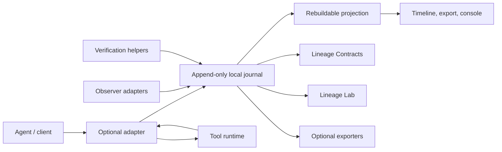

# ActionLineage

**Know what the agent did, and show what changed.**

ActionLineage is an alpha-stage, vendor-neutral evidence and detection plane for
tool-using agents. It correlates agent intent, delegated identity, tool
execution, and independently observed side effects into investigation-ready
local evidence.

The central rule is simple: a successful tool response is an acknowledgement,
not proof of a side effect. ActionLineage records requested, authorized,
dispatched, acknowledged, observed, verified, unverified, timed-out,
conflicting, and not-dispatched outcomes as separate facts.

## Current Maturity

This repository is a public alpha. Core evidence recording is usable for local
evaluation and fixture-backed integration work, but service deployments,
external adapters, cloud observers, containers, and published release artifacts
are preview surfaces until they are externally validated.

| Surface | Maturity | Evidence |
| --- | --- | --- |
| Event envelope, redaction, local journal, SQLite projection | Alpha-supported | Unit, compatibility, projection, and security tests |
| Deterministic verified/unverified/conflicting/not-dispatched demo | Alpha-supported | `make demo`, demo tests, contract validation |
| Case export, graph export, grounded summary, static console | Alpha-supported | Projection and console tests |
| Lineage Contracts, sequence detections, Lineage Lab | Local-proof | Contract, detection, and replay tests |
| MCP, policy, OpenTelemetry, service, Postgres, cloud/Kubernetes fixtures | Preview | Optional extras and local fixture tests |
| Signed artifacts, hosted provenance, external audits, production history | Planned or external-validation-required | See `docs/DECISIONS_REQUIRED.md` |

Full claim mapping lives in
[docs/QUALITY_SCORECARD.md](docs/QUALITY_SCORECARD.md).

## Five-Minute Local Evaluation

Prerequisites:

- Python 3.13 or newer
- `uv`
- `make` for convenience targets

Install all optional extras used by the test suite:

```bash
uv sync --locked --all-extras
```

Run the deterministic local demo:

```bash
make demo
```

The demo requires no model API key, cloud account, external service, or internet
access. It writes artifacts under `build/actionlineage-demo/`:

- `evidence.jsonl`: canonical append-only local journal.
- `projection.sqlite`: rebuildable query projection.
- `timeline.json`: compact event-order summary.
- `incident.json`: machine-readable incident export.

Inspect the evidence:

```bash
uv run actionlineage journal verify build/actionlineage-demo/evidence.jsonl

uv run actionlineage projection timeline \
  build/actionlineage-demo/projection.sqlite \
  --trace-id trace_demo_evidence_plane

uv run actionlineage projection summarize \
  build/actionlineage-demo/projection.sqlite \
  --trace-id trace_demo_evidence_plane

uv run actionlineage projection export-case \
  build/actionlineage-demo/projection.sqlite \
  build/actionlineage-demo/case \
  --trace-id trace_demo_evidence_plane

uv run actionlineage projection export-console \
  build/actionlineage-demo/projection.sqlite \
  build/actionlineage-demo/console.html \
  --trace-id trace_demo_evidence_plane

uv run actionlineage contract validate \
  contracts/examples/outbound-http.json \
  build/actionlineage-demo/evidence.jsonl
```

Open `build/actionlineage-demo/console.html` in a browser to review the static
timeline, event details, graph, verification matrix, and case context.

The stricter `contracts/examples/restricted-exfiltration.json` contract is a
design example for detection coverage; it is not the five-minute demo contract.

## What The Demo Shows

The default scenario emits a deterministic local journal that includes:

- a recorded human intent and agent run;
- a verified file-read side effect corroborated by a local filesystem observer;
- an acknowledged HTTP send that remains unverified because acknowledgement is
  not side-effect evidence;
- a conflicting receiver observation represented as
  `side_effect.conflict_detected`;
- a policy-denied shell-like request represented as
  `tool.execution.not_dispatched` with `downstream_forwarded=false`.

## Evidence Lifecycle

| State | Meaning |
| --- | --- |
| `agent.intent.recorded` | A human, service, scheduler, or agent initiated a run. |
| `tool.execution.requested` | An agent or adapter requested a tool invocation. |
| `tool.execution.authorized` | An optional policy or approval path allowed the request. |
| `tool.execution.dispatched` | The request crossed the tool boundary. |
| `tool.execution.acknowledged` | The tool or adapter returned a response. |
| `side_effect.observed` | A named observer recorded resource or environment evidence. |
| `side_effect.verified` | Corroborating evidence supports the subject event. |
| `side_effect.unverified` | Evidence is insufficient or only self-reported. |
| `side_effect.timed_out` | Observation or verification did not complete in time. |
| `side_effect.conflict_detected` | Evidence sources disagree and both sides are retained. |
| `tool.execution.not_dispatched` | A request was blocked, denied, or not sent downstream. |

Verification requires independent or explicitly identified corroborating
evidence. Missing observations are reported as missing observations only.

## Architecture



Core packages do not import MCP, OpenTelemetry, model-provider SDKs, FastAPI, or
cloud SDKs. Those surfaces live behind optional adapter or service boundaries.

## How This Differs

| Tooling category | Main focus | ActionLineage difference |
| --- | --- | --- |
| Distributed tracing | Request flow and latency | Adds evidence status, side-effect verification, and investigation exports |
| Agent gateway | Mediation or policy enforcement | Treats enforcement as optional adapter behavior |
| Guardrail | Preventing or blocking actions | Preserves evidence, uncertainty, and conflicts even when no block occurs |
| SIEM/logging | Event collection and search | Adds causal evidence links and telemetry contract validation |

## Python API Example

```python
from datetime import UTC, datetime
from pathlib import Path

from actionlineage import (
    Classification,
    Correlation,
    EvidenceNormalizer,
    EvidenceRecord,
    EvidenceSourceKind,
    EventType,
    FixedClock,
    FixedIdGenerator,
    LocalJournal,
    NormalizedAction,
    NormalizedResource,
    Principal,
    PrincipalType,
    ResourceType,
    Sensitivity,
    Source,
    ToolIdentity,
    import_evidence_batch,
    verify_journal,
)

journal_path = Path("build/example/evidence.jsonl")
journal = LocalJournal(journal_path)
normalizer = EvidenceNormalizer(
    correlation=Correlation(trace_id="trace_example", run_id="run_example"),
    source=Source(component="example_adapter", instance_id="local", version="0.1.0a1"),
    principal=Principal(principal_id="agent_example", principal_type=PrincipalType.AGENT),
    classification=Classification(sensitivity=Sensitivity.INTERNAL),
    clock=FixedClock(datetime(2026, 1, 1, tzinfo=UTC)),
    id_generator=FixedIdGenerator(("evt_example_001", "evt_example_002")),
)

intent = EvidenceRecord(
    idempotency_key="example-intent-001",
    source_kind=EvidenceSourceKind.LOCAL_FUNCTION,
    event_type=EventType.AGENT_INTENT_RECORDED,
    payload={"intent": {"summary": "Read a workspace report"}},
    sort_key="000",
)

action = EvidenceRecord.from_action(
    idempotency_key="example-action-001",
    source_kind=EvidenceSourceKind.LOCAL_FUNCTION,
    sort_key="001",
    action=NormalizedAction(
        action_type="read",
        tool_identity=ToolIdentity(
            name="safe_file_read",
            descriptor_hash="sha256:example_descriptor",
            adapter="local",
        ),
        resources=(
            NormalizedResource(
                resource_type=ResourceType.FILE,
                identifier="demo://workspace/report.txt",
            ),
        ),
    ),
)

result = import_evidence_batch([intent, action], normalizer=normalizer, journal=journal)
assert result.ok
assert verify_journal(journal_path).ok
```

See [docs/API_REFERENCE.md](docs/API_REFERENCE.md) for alpha-supported public
imports and preview API boundaries.

## CLI Highlights

```bash
uv run actionlineage version
uv run actionlineage demo run --output-dir build/actionlineage-demo
uv run actionlineage journal verify build/actionlineage-demo/evidence.jsonl
uv run actionlineage projection timeline build/actionlineage-demo/projection.sqlite --trace-id trace_demo_evidence_plane
uv run actionlineage projection explain-event build/actionlineage-demo/projection.sqlite evt_demo_11
uv run actionlineage projection export-incident build/actionlineage-demo/projection.sqlite --trace-id trace_demo_evidence_plane
uv run actionlineage projection export-graph build/actionlineage-demo/projection.sqlite --trace-id trace_demo_evidence_plane
uv run actionlineage projection export-desktop-bundle build/actionlineage-demo/projection.sqlite build/actionlineage-demo/desktop --trace-id trace_demo_evidence_plane
uv run actionlineage contract validate contracts/examples/outbound-http.json build/actionlineage-demo/evidence.jsonl
```

See [docs/CLI_REFERENCE.md](docs/CLI_REFERENCE.md) for the full command
reference.

## Documentation Map

- [Maturity model](docs/MATURITY.md): supported, preview, planned, and external
  validation labels.
- [Quality scorecard](docs/QUALITY_SCORECARD.md): public claim-to-evidence map.
- [Architecture](ARCHITECTURE.md): component boundaries and runtime flow.
- [Threat model](THREAT_MODEL.md): assets, adversaries, trust boundaries, and
  claim language.
- [Acceptance tests](ACCEPTANCE_TESTS.md): executable release criteria.
- [Data model](docs/DATA_MODEL.md): event envelope and payload conventions.
- [Schema reference](docs/SCHEMA_REFERENCE.md): `v1alpha1` event schema.
- [Compatibility](docs/COMPATIBILITY.md): supported journal and schema policy.
- [Tutorial](docs/TUTORIAL.md): local demo walkthrough.
- [Investigation workflow](docs/INVESTIGATION.md): timelines, summaries, graph,
  and case bundles.
- [Console](docs/CONSOLE.md): static analyst UI and desktop bundle export.
- [Journal integrity](docs/JOURNAL_INTEGRITY.md): anchors, archive manifests,
  recovery, and limits.
- [Lineage Contracts](docs/LINEAGE_CONTRACTS.md): telemetry requirements as
  code.
- [Detection Lab](docs/DETECTION_LAB.md): replay, mutation, minimization, and
  scorecards.
- [Observers](docs/OBSERVERS.md): local, fixture, cloud, Kubernetes, and external
  sensor evidence.
- [Integrations](docs/INTEGRATIONS.md): exporters and optional ecosystem
  adapters.
- [Operations](docs/OPERATIONS.md): service mode, health, storage, and deployment
  notes.
- [Release checklist](docs/RELEASE_CHECKLIST.md): public release gates.
- [Decisions required](docs/DECISIONS_REQUIRED.md): owner and external gates.

## Packages and Extras

The repository currently ships as one Python distribution with optional extras:

```bash
uv sync --locked                 # core
uv sync --locked --extra adapters
uv sync --locked --extra service
uv sync --locked --all-extras
```

Core dependencies are intentionally small: Pydantic and Typer. Optional extras
hold MCP, OpenTelemetry, SQLAlchemy, FastAPI, JWT, and related integration
dependencies.

## Security Model In One Paragraph

ActionLineage is not a sandbox, model guardrail, DLP engine, or universal proof
system. It records redacted, structured, causally linked evidence and verifies
local journal consistency under documented trust assumptions. When a report says
an outcome is verified, it means the named evidence source corroborated it
within the stated limitations. When no observation exists, the system reports
that no observation was recorded.

## Development

```bash
uv sync --locked --all-extras
uv run ruff check .
uv run ruff format --check .
uv run mypy src
uv run pytest
uv run python scripts/check_claims_language.py .
uv run python scripts/secret_scan.py .
uv run pip-audit
```

Before release, also run:

```bash
uv run python scripts/generate_sbom.py --output build/actionlineage-sbom.json
uv run python scripts/generate_release_provenance.py \
  --dist-dir dist \
  --output build/actionlineage-release-provenance.json
uv build
```

## License

Apache License 2.0. See [LICENSE](LICENSE).
