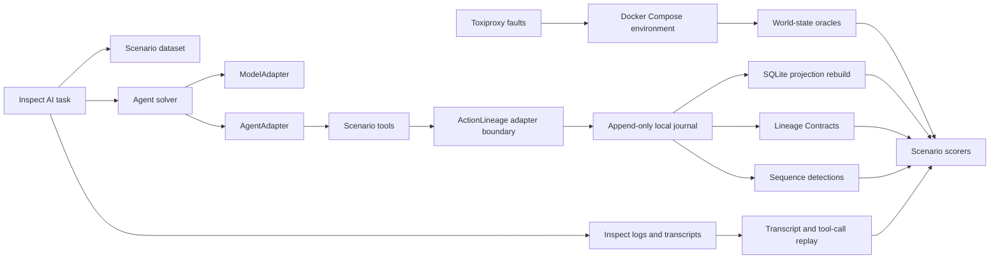

# Agent Validation Lab Architecture

## Status

The ActionLineage Agent Validation Lab is a development-only evaluation surface.
This document describes the implemented architecture and remaining operating
constraints; it does not add a supported runtime, a public schema change, or a
new alpha release claim.

The lab remains outside ActionLineage core dependencies. Eval code may import
public ActionLineage APIs, but domain, journal, projection, adapters, service,
CLI, and the default demo must never import eval packages or model provider
SDKs.

## Objective

The lab evaluates real tool-using agents against deterministic environments and
ActionLineage evidence invariants. It is coverage-guided, but the primary
coverage unit is semantic capability and evidence lifecycle coverage, not Python
line coverage.

Authoritative results come from independent world-state oracles, ActionLineage
journals, projections, contracts, detections, redaction scans, and replay
artifacts. Agent text, tool acknowledgements, and model self-assessments are
recorded as evidence, but they are never authoritative pass/fail sources.

## System View



Inspect AI is the outer harness because it already models evaluations as
datasets, agent or solver logic, model calls, tools, scorers, and structured log
artifacts. The ActionLineage lab uses Inspect for orchestration and transcript
capture, while ActionLineage-specific scorers inspect durable evidence.

## Development Package Boundary

The implementation uses this repository shape:

```text
evals/
  README.md
  CAPABILITY_COVERAGE.yaml
  SCENARIO_SCHEMA.json
  scenarios/
  actionlineage_evals/
  docker/
  scenarios/
```

Dependency rules:

- Eval dependencies belong in the uv `eval` dependency group.
- `inspect-ai`, model clients, Docker/Toxiproxy helpers, and eval HTTP helpers
  must not enter `[project.dependencies]` or the existing runtime extras.
- Eval modules may depend on public imports documented in `docs/API_REFERENCE.md`.
- Core modules must not import `evals` or `actionlineage_evals`.
- `check-boundaries` parses ActionLineage core imports and fails PR CI if core
  imports eval-only packages, Inspect, or model-provider libraries.
- Generated eval artifacts belong under `build/evals/` or `/tmp`, not in source.

## Dev-Only Protocols

The implementation defines narrow protocols inside the eval package. They are
design interfaces, not ActionLineage public APIs.

```python
class ModelAdapter(Protocol):
    def generate(self, request: ModelRequest) -> ModelResponse: ...

class AgentAdapter(Protocol):
    def run(self, scenario: Scenario, tools: ToolRegistry) -> AgentRunResult: ...

class EnvironmentController(Protocol):
    def start(self, scenario: Scenario) -> EnvironmentHandle: ...
    def stop(self, handle: EnvironmentHandle) -> EnvironmentArtifacts: ...

class WorldStateOracle(Protocol):
    def observe(self, handle: EnvironmentHandle) -> OracleObservation: ...

class TranscriptReplay(Protocol):
    def replay(self, bundle: ReplayBundle) -> ReplayResult: ...

class ScenarioScorer(Protocol):
    def score(self, evidence: ScenarioEvidence) -> ScoreResult: ...
```

The concrete adapters include a no-model replay adapter, a GitHub Models adapter
for scheduled runs, a scripted no-model adapter for PR validation, an
OpenAI-compatible adapter for local chat-completions servers, and an optional
Ollama adapter for local runs. The `inspect-run` CLI entrypoint is the primary
live-run wrapper; the lower-level `run` command remains available for
deterministic no-model and replay-oriented development.

## Scenario DSL

`evals/SCENARIO_SCHEMA.json` defines the scenario manifest version:
`actionlineage.dev/eval-scenario/v0`.

A scenario manifest describes:

- Human intent and scenario goal.
- Allowed tools and descriptors.
- Docker Compose services, volumes, health checks, and teardown expectations.
- Toxiproxy faults and deterministic timing.
- Expected environment state before and after the run.
- Expected ActionLineage lifecycle events, evidence links, contracts, detections,
  and capability coverage.
- Model and tool-call budgets.
- Required replay provenance.

The scenario DSL does not define new ActionLineage event types and does not alter
the `actionlineage.dev/v1alpha1` event envelope.

## Docker Environment Lifecycle

Live or Docker-enabled scenario runs use a disposable Compose project:

- Project name: `actionlineage-eval-<run-id>`.
- Artifact root: `build/evals/<run-id>/`.
- Isolated named volumes or temp bind mounts.
- Deterministic fixture material copied into the environment at start.
- Explicit health checks before the agent receives tools.
- Captured `docker compose config`, image digests, container logs, exposed ports,
  and exit states.
- Deterministic teardown with a post-teardown leak check for containers,
  networks, and volumes.

Compose services publish random host ports. The environment controller records
the published receiver and Toxiproxy ports in `environment.json`, and
world-state oracles use those discovered URLs. This keeps local and CI Docker
runs parallel-safe without relying on fixed host ports.

The disposable Compose fixture is constrained for development safety: services
drop Linux capabilities, use `no-new-privileges`, run with read-only root
filesystems where possible, write scratch data to tmpfs, use explicit resource
caps, and communicate through an explicit eval network.

Toxiproxy sits between the agent/tool runtime and selected networked test
services. Each toxic records name, target proxy, direction, parameters,
toxicity, start time, removal time, and seed when randomness is used.

## Independent Oracles

Oracles observe environment state without asking the agent whether it succeeded.
The initial oracle set should cover:

- Filesystem existence, type, size, digest, and bounded metadata.
- Receiver request logs with request ID, method, target, status, and body digest.
- Process status and exit metadata.
- SQLite row/readback state for local database side effects.
- Toxiproxy proxy and toxic state.
- Journal verification result and trusted tail values.
- SQLite projection rebuild result.
- Contract validation result.
- Detection matches and alert evidence references.
- Service authz decisions for synthetic service-mode auth boundaries.
- Redaction canary scans across journals, logs, transcripts, exports, and errors.

Missing observations must leave outcomes unverified, timed out, or inconclusive
according to the scenario. They must not be worded as evidence that no side
effect occurred.

## Scorers

Scorers are deterministic functions over scenario manifests, oracle observations,
ActionLineage evidence, Inspect logs, and replay artifacts.

Required scorer families:

- **Lifecycle scorer**: checks requested, authorized, dispatched,
  acknowledged, observed, verified, unverified, timed-out, conflicting, and
  not-dispatched states as separate facts.
- **Integrity scorer**: verifies journal hash chain, trusted tail metadata, and
  projection rebuild.
- **Redaction scorer**: scans every persisted artifact for configured canaries
  and known sensitive field patterns.
- **Contract scorer**: runs required Lineage Contracts and records exact
  violations.
- **Detection scorer**: evaluates built-in and scenario-selected detections.
- **Capability scorer**: compares scenario coverage against
  `evals/CAPABILITY_COVERAGE.yaml`.
- **Replayability scorer**: replays transcripts and tool calls without model
  calls and checks that deterministic outputs match.
- **Replay-equivalence scorer**: compares replay scorecard essentials with the
  source run and reports semantic mismatches as harness failures.
- **Failure classifier**: assigns one of `product_failure`, `agent_failure`,
  `harness_failure`, `provider_failure`, or `inconclusive_budget_exhausted`.
- **Scenario linter**: verifies semantic scenario quality that JSON Schema
  cannot express, including authoritative oracles, replay artifacts, coverage
  references, required scorers, and failure-control tagging.

## Replay And Minimization

Every live run must produce a replay bundle with enough provenance to rerun the
case without a model provider:

- Scenario manifest and schema version.
- Seed and mutation sequence.
- Model adapter identity, model ID, generation parameters, and request counts.
- Prompt and tool-template hashes.
- Tool descriptors and descriptor hashes.
- Transcript, tool-call sequence, tool arguments after redaction, and tool
  acknowledgements.
- World-state oracle observations.
- Journal, trusted tail metadata, projection output, contract results, detection
  results, and scorecard.
- Stateful mutation-minimization report when a scenario generated and minimized
  a lifecycle counterexample.
- Docker Compose config digest, image digests, service logs, and Toxiproxy
  timeline.
- Run provenance with scenario, schema, capability coverage, commit, workflow,
  adapter, environment, and artifact hashes.

Failure minimization should first remove irrelevant transcript turns, then
irrelevant tool calls, then irrelevant environment perturbations, while
preserving the same failure classification. Promotion to `evals/regressions/`
requires human review, a stable minimized replay bundle, provenance and triage
artifacts, and a clean artifact audit.

Generated artifacts can be scanned independently with `audit-artifacts`. The
audit reports pattern names and file paths for redaction canaries and credential
patterns, but it never echoes the matched sensitive value.

Every suite run writes `suite-summary.json` for local triage, including a stable
`failure_fingerprint` for failed or expected-control cases. The `trend` command
turns a suite artifact root into an appendable JSON trend report and optional
Markdown summary with scorecard, coverage, replay-equivalence, and artifact
audit metrics. GitHub Actions job summaries render scorecard and trend data as
Markdown, including failure classes, replay-equivalence counts, first failing
scorer, artifact paths, and exact replay commands.

## CI Lanes

Pull-request lane:

- Trigger: `pull_request`.
- Permissions: `contents: read`.
- Model requests: zero.
- Runs schema validation, replay-only scenarios, deterministic fixture checks,
  semantic scenario linting, import-boundary checks, and optional no-network
  Docker smoke.
- Must not use `pull_request_target` or repository model credentials.

Scheduled no-model lane:

- Trigger: `schedule` and manual dispatch on the default branch.
- Permissions: `contents: read`.
- Model requests: zero.
- Runs the deterministic scripted suite, a no-model Inspect smoke, replay path,
  reviewed regression corpus, artifact audit, public-report generation, trend
  report generation, and `check-public-baseline` freshness checks from trusted
  code.
- Uploads generated artifacts for maintainer review.

Scheduled live-model lane:

- Trigger: `schedule` and manual dispatch on the default branch.
- Permissions: `contents: read`, `models: read`.
- Uses Inspect as the outer harness and GitHub Models through a common
  `ModelAdapter`.
- Skips all live-model execution unless the explicit `GH_MODELS_TOKEN`
  repository or organization secret is configured. GitHub Actions rejects secret
  names beginning with `GITHUB_`, so `GH_MODELS_TOKEN` is the repository secret
  name.
- Enforces strict request, token, tool-call, and wall-clock budgets.
- Replays live-run bundles, audits artifacts, and emits a scheduled trend
  report in the same workflow.
- Uploads redacted artifacts for maintainer review.

Local lane:

- Trigger: developer command.
- Uses replay, GitHub Models with a local token, or optional Ollama at
  `http://localhost:11434` or an OpenAI-compatible local `/v1` endpoint.
- Local Ollama runs are still bounded by turns, tool calls, and time.

## External References

- [Inspect AI](https://inspect.aisi.org.uk/)
- [Inspect logs](https://inspect.aisi.org.uk/eval-logs.html)
- [GitHub Models quickstart](https://docs.github.com/en/github-models/quickstart)
- [GitHub Actions AI inference](https://github.com/actions/ai-inference)
- [GitHub Actions secret guidance](https://docs.github.com/en/actions/how-tos/write-workflows/choose-what-workflows-do/use-secrets)
- [Toxiproxy](https://github.com/shopify/toxiproxy)
- [Hypothesis stateful testing](https://hypothesis.readthedocs.io/en/latest/stateful.html)
- [Ollama API](https://docs.ollama.com/api/introduction)
